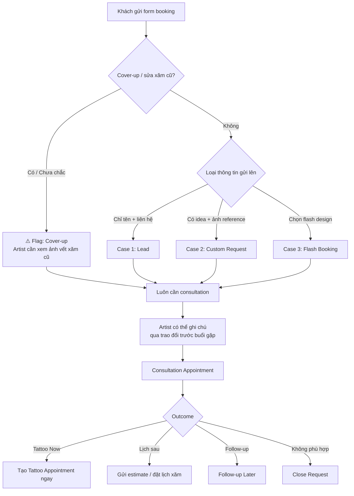
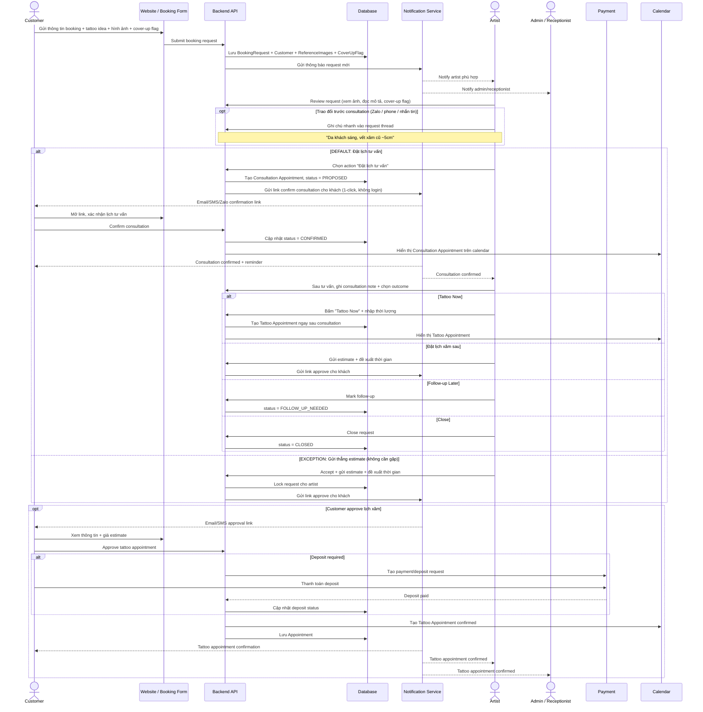
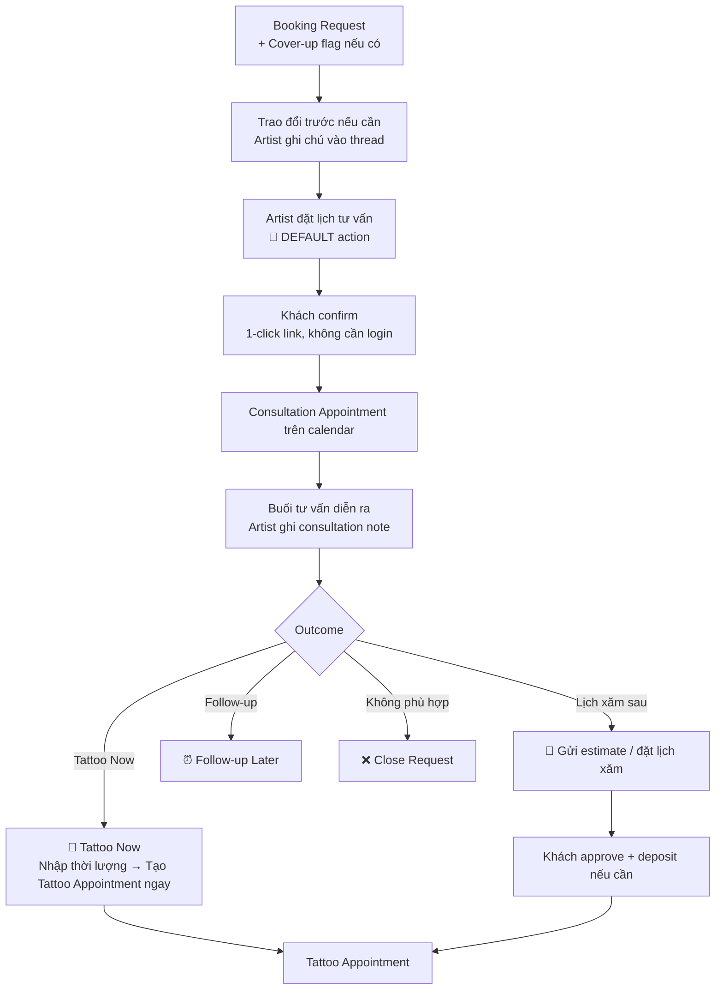
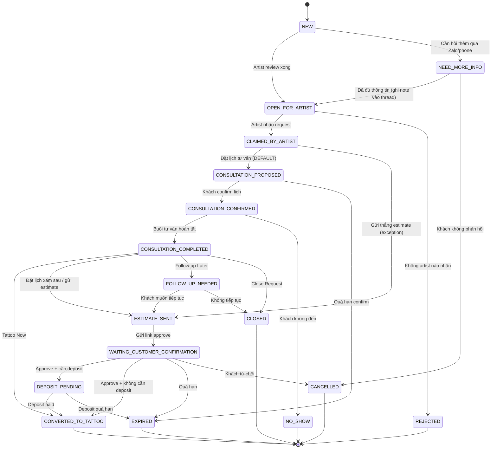
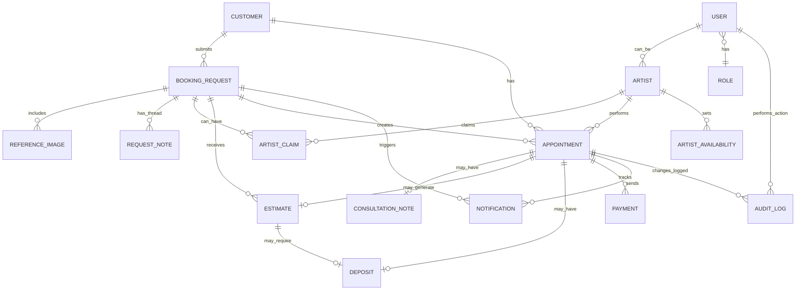
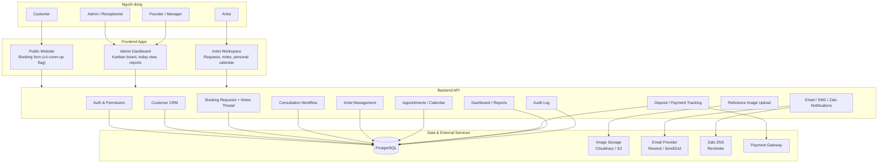
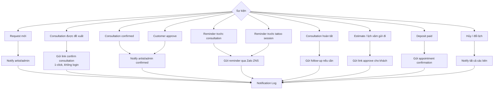
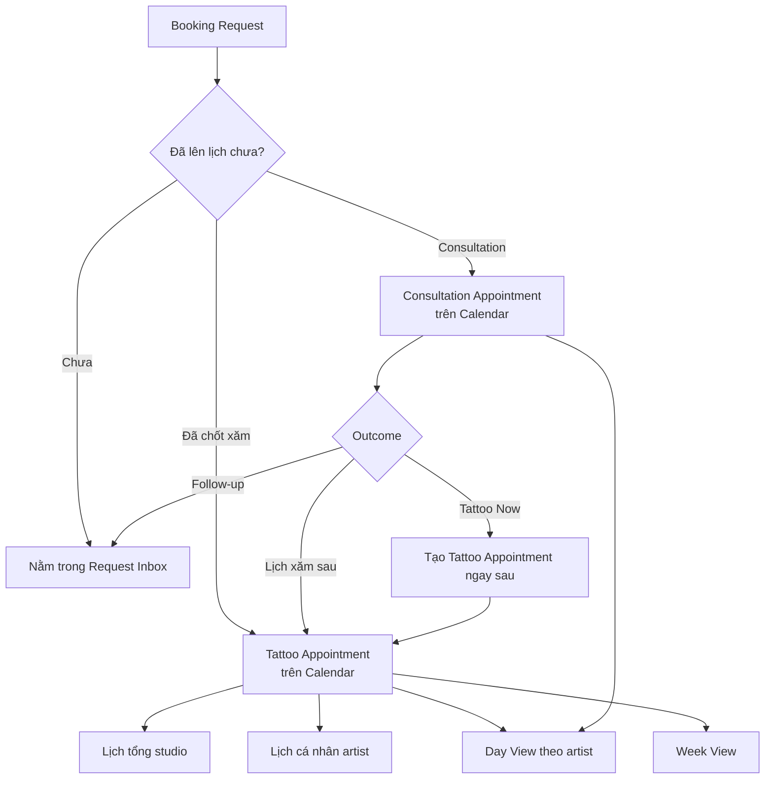

# Tattoo Studio Booking / CRM System Overview

> Mô tả hệ thống booking/CRM cho tattoo studio kèm các sơ đồ
> *Lưu ý: Đây chỉ là MVP demo cơ bản, chưa phải production thật*

---

## 1. Cách hiểu

Hệ thống không xem mọi thông tin khách gửi lên là một lịch hẹn đã chốt ngay từ đầu.

Tách thành 3 khái niệm:

| Khái niệm | Cách hiểu | Khi nào |
|---|---|---|
| Tattoo Request | Yêu cầu ban đầu của khách — là một "living thread" lưu toàn bộ context | Khi khách mới gửi form |
| Consultation Appointment | Lịch tư vấn — là **default path**, gần như mọi request đều qua đây | Hầu hết mọi trường hợp |
| Tattoo Appointment / Tattoo Session | Lịch xăm thật | Khi artist/studio và khách đã thống nhất sau tư vấn |

**Nguyên tắc cốt lõi:**

```text
Consultation là DEFAULT, không phải optional.

Gần như 100% khách cần tư vấn — kể cả khách gửi ảnh reference rõ ràng,
chọn flash design, hay đã xăm nhiều lần — vì artist cần:
  - Xem da thật (tối, sáng, nhạy cảm, stretch marks...)
  - Xác nhận vị trí thật trên cơ thể
  - Phát hiện cover-up / sửa vết xăm cũ
  - Đảm bảo khách hiểu đúng về design
```

```text
Request là "living thread":

Mọi trao đổi ngoài hệ thống (Zalo, gọi điện, nhắn tin)
đều được artist ghi chú nhanh vào request thread.
→ Không còn phụ thuộc vào trí nhớ khi xử lý 10+ khách song song.
```

---

## 2. Sơ đồ tổng quan

```mermaid
flowchart LR
    Customer["Khách hàng"] --> PublicSite["Website / Booking Form"]

    PublicSite --> RequestInbox["Request Inbox<br/>Danh sách yêu cầu mới"]

    RequestInbox --> Review["Artist/Admin review<br/>Xem ý tưởng, hình ảnh, flag cover-up"]

    Review --> Decision{"Action"}

    Decision -->|"DEFAULT ~90%"| ConsultationProposal["Đặt lịch tư vấn"]
    Decision -->|"Không cần gặp ~10%"| Estimate["Gửi thẳng estimate"]
    Decision -->|"Không phù hợp"| Closed["Pass / Reject"]

    ConsultationProposal --> CustomerConsultConfirm["Khách xác nhận lịch tư vấn<br/>1-click, không cần login"]
    CustomerConsultConfirm --> ConsultationAppt["Consultation Appointment<br/>Hiện trên calendar"]

    ConsultationAppt --> PreConsult["Trao đổi trước buổi gặp<br/>Zalo/phone → Artist ghi chú vào thread"]
    PreConsult --> ConsultDone["Buổi tư vấn diễn ra"]

    ConsultDone --> ConsultOutcome{"Outcome"}

    ConsultOutcome -->|"Tattoo ngay"| TattooNow["Tattoo Now<br/>Tạo Tattoo Appointment ngay sau"]
    ConsultOutcome -->|"Lịch xăm sau"| ScheduleTattoo["Đặt lịch xăm sau"]
    ConsultOutcome -->|"Chưa chốt"| FollowUp["Follow-up Later"]
    ConsultOutcome -->|"Không phù hợp"| ClosedEnd["Close"]

    Estimate --> CustomerConfirm["Khách xác nhận estimate"]
    ScheduleTattoo --> CustomerConfirm

    CustomerConfirm --> DepositCheck{"Cần deposit?"}
    DepositCheck -->|"Không"| TattooAppointment["Tattoo Appointment Confirmed"]
    DepositCheck -->|"Có"| Deposit["Khách thanh toán deposit"]
    Deposit --> TattooAppointment
    TattooNow --> TattooAppointment

    TattooAppointment --> Calendar["Booking Calendar"]
    TattooAppointment --> Reminder["Nhắc lịch / thông báo"]
    TattooAppointment --> Report["Dashboard / báo cáo"]
```



---

## 3. Request là "Living Thread"

Mỗi request không phải form tĩnh — nó là một thread lưu toàn bộ context của khách:

```text
REQUEST #042 — John Doe
─────────────────────────────────────────────────
[Thông tin ban đầu khách gửi]
  Ý tưởng : Hoa sen blackwork
  Vị trí  : Cánh tay trái
  Hình ref: [3 ảnh]
  Cover-up: ⚠️ Sửa vết xăm cũ          ← Flag từ booking form

[Notes / Timeline]
  15/06 10:30 — Artist Nam:
    "Gọi điện: vết xăm cũ ~5cm màu xanh nhạt,
     da sáng. Khách muốn cover hoàn toàn."

  15/06 14:00 — Artist Nam:
    Đã gửi link chọn lịch tư vấn

  16/06 09:00 — System:
    ✅ Khách confirm tư vấn 17/06 10:00

[Actions]
  [📝 Ghi chú nhanh]  [📅 Đặt lịch tư vấn]  [✉️ Gửi link khách]
─────────────────────────────────────────────────
```

**Nguyên tắc ghi chú:**

```text
❌ Sai — Form phức tạp mà artist sẽ bỏ qua:
   Placement: [____]
   Size: [____]
   Skin condition: [dropdown]
   Cover-up: [checkbox]

✅ Đúng — Text field đơn giản như nhắn tin:
   [Ghi chú nhanh về khách này...]  [Lưu]

Structured data chỉ điền khi tạo appointment thật —
lúc đó thông tin đã rõ và artist có lý do để điền.
```

---

## 4. Booking Form: Flag cover-up từ đầu

Ngay trong form booking của khách, hỏi một câu đơn giản:

```text
Đây là loại xăm nào?
  ● Xăm mới hoàn toàn
  ○ Sửa / cover vết xăm cũ
  ○ Chưa chắc / cần tư vấn
```

Flag này tự động hiển thị nổi bật trong request card để artist nhận biết ngay mà không cần đọc hết mô tả.

---

## 5. Ba loại input từ khách — tất cả đều nên qua consultation



> **Lưu ý:** Case 3 (flash design) vẫn nên qua consultation ngắn (15–20 phút) để artist kiểm tra da và vị trí. Chỉ bỏ qua consultation nếu artist đã biết rõ khách (khách quen, đã xăm nhiều lần tại studio).

---

## 6. Luồng xử lý chính: từ request đến appointment



---

## 7. Consultation flow chi tiết

Consultation là appointment thật — chiếm thời gian artist/studio, cần hiện trên calendar, có reminder, có consultation note, có outcome rõ ràng.



**Nếu "Tattoo Now":**

```text
Artist chỉ cần chọn thời lượng (ví dụ: 2h).
Hệ thống tự động:
  - Tạo Tattoo Appointment ngay sau Consultation
  - Copy customer / request / reference images
  - Set type = TATTOO_SESSION
  - Mark consultation = COMPLETED
  - Mark request = CONVERTED

Calendar sau khi bấm:
  10:00 - 10:30  Consultation   — John Doe
  10:30 - 12:30  Tattoo Session — John Doe
```

---

## 8. Artist UI — đơn giản như app task

Artist không cần thấy status kỹ thuật. Chỉ cần **3 khu vực chính**:

```text
┌─────────────────────────────────────────────────┐
│  1. NEW REQUESTS          2 mới                 │
│  2. MY CONSULTATIONS      1 hôm nay             │
│  3. MY APPOINTMENTS       3 tuần này            │
└─────────────────────────────────────────────────┘
```

**Trong mỗi request card, artist thấy:**

```text
┌─────────────────────────────────────────────────┐
│  John Doe                    ⚠️ Cover-up        │
│  Hoa sen blackwork — cánh tay trái              │
│  [3 ảnh ref]                                    │
│  Budget: 2–3 triệu · Preferred: tuần sau        │
│                                                 │
│  [📅 Đặt lịch tư vấn]  [⚡ Gửi estimate]       │
│  [❓ Hỏi thêm]          [❌ Pass]               │
│                                                 │
│  📝 Notes (2)                          [+ Ghi] │
│  "Da sáng, vết xăm cũ ~5cm màu xanh"           │
└─────────────────────────────────────────────────┘
```

**Action sau consultation:**

```text
┌─────────────────────────────────────────────────┐
│  [🎨 Tattoo Now]      [📅 Đặt lịch xăm sau]    │
│  [⏰ Follow-up Later] [❌ Close]                │
└─────────────────────────────────────────────────┘
```

**Artist không cần biết** các status kỹ thuật phía sau.

---

## 9. Receptionist / Manager UI — Booking Board

### Kanban Board

```text
┌──────────────┬──────────────┬──────────────┬──────────────┬──────────────┐
│ New Requests │ Consultation │   Waiting    │  Confirmed   │  Completed   │
│              │  Scheduled   │   Customer   │              │   / Closed   │
├──────────────┼──────────────┼──────────────┼──────────────┼──────────────┤
│ [John Doe]   │ [Jane Doe]   │ [Jack Doe]   │ [Tom Nguyen] │ [Old Cases]  │
│ cover-up ⚠️  │ 17/06 10:00  │ Approve link │ 20/06 14:00  │              │
│              │              │ đã gửi       │ ✅ Deposit   │              │
│ [Assign]     │ [Reschedule] │ [Remind]     │ [Check-in]   │              │
│ [Schedule]   │ [Note]       │ [Cancel]     │ [Complete]   │              │
└──────────────┴──────────────┴──────────────┴──────────────┴──────────────┘
```

### Today View — view quan trọng nhất cho receptionist buổi sáng

```text
TODAY — Thứ 6, 20/06
─────────────────────────────────────────────────
10:00  Consultation   John Doe     [Ghi note] [Tattoo Now]
10:30  Tattoo Session John Doe     [Check-in] [Completed]
13:00  Tattoo Session Jane Doe     [Check-in]
15:00  Consultation   Jack Doe     [Ghi note]
─────────────────────────────────────────────────
4 appointments · 1 deposit pending ⚠️
```

---

## 10. Nguyên tắc thiết kế UI

### 1. Không để user chọn status trực tiếp

```text
❌ Sai:
   BookingRequest.status = [dropdown]

✅ Đúng:
   Button action → hệ thống tự update status
```

### 2. Mỗi màn hình chỉ hiện "next action" phù hợp

```text
Request mới:
  [📅 Đặt lịch tư vấn]  [⚡ Gửi estimate]  [❓ Hỏi thêm]  [❌ Pass]

Sau consultation:
  [🎨 Tattoo Now]  [📅 Đặt lịch xăm sau]  [⏰ Follow-up]  [❌ Close]

Waiting deposit:
  [✅ Mark Deposit Paid]  [📩 Gửi lại reminder]  [❌ Cancel]
```

### 3. Customer-facing page phải 1-click, không cần login

```text
╔══════════════════════════════════════╗
║  [Studio Name] mời bạn xác nhận     ║
║  lịch tư vấn xăm                    ║
║                                      ║
║  Ngày: Thứ 6, 20/06/2025             ║
║  Giờ:  10:00 - 10:30                 ║
║  Artist: [Tên artist]                ║
║  Địa chỉ: [Địa chỉ studio]           ║
║                                      ║
║  [✅ Xác nhận]   [📅 Đổi lịch]      ║
╚══════════════════════════════════════╝
```

### 4. Ghi chú nhanh như nhắn tin

```text
Ghi chú field trong request:
  [Nhập ghi chú nhanh về khách này...]  [Lưu]

→ Hiển thị như timeline/thread
→ Có timestamp + tên người ghi
→ Artist dùng như "Zalo với chính mình"
```

---

## 11. Vòng đời trạng thái của Booking Request

> *Status là internal — user không thấy trực tiếp, chỉ thấy action buttons*



---

## 12. Appointment type và Appointment status

```text
BookingRequest.status (internal):
  NEW · NEED_MORE_INFO · OPEN_FOR_ARTIST · CLAIMED_BY_ARTIST
  CONSULTATION_PROPOSED · CONSULTATION_CONFIRMED · CONSULTATION_COMPLETED
  FOLLOW_UP_NEEDED · ESTIMATE_SENT · WAITING_CUSTOMER_CONFIRMATION
  DEPOSIT_PENDING · CONVERTED_TO_TATTOO
  CLOSED · CANCELLED · EXPIRED · REJECTED · NO_SHOW
```

```text
Appointment.type:
  CONSULTATION
  TATTOO_SESSION
  TOUCH_UP
  BLOCKED_TIME
```

```text
Appointment.status:
  PROPOSED · CONFIRMED · COMPLETED · CANCELLED · NO_SHOW · RESCHEDULED
```

---

## 13. Data model



**Field quan trọng:**

```text
BookingRequest:
  - id
  - customer_id
  - is_cover_up: boolean          ← flag từ booking form
  - cover_up_description: text    ← mô tả vết xăm cũ nếu có
  - tattoo_idea
  - placement
  - size_estimate
  - budget_min / budget_max
  - preferred_date
  - status
  - claimed_by_artist_id

RequestNote:
  - id
  - booking_request_id
  - author_id                     ← artist / admin ghi
  - content                       ← free text, như nhắn tin
  - created_at

Appointment:
  - id
  - booking_request_id
  - customer_id
  - artist_id
  - type: CONSULTATION | TATTOO_SESSION | TOUCH_UP | BLOCKED_TIME
  - status: PROPOSED | CONFIRMED | COMPLETED | CANCELLED | NO_SHOW | RESCHEDULED
  - start_time
  - end_time
  - price_estimate_min
  - price_estimate_max
  - final_price
  - note

ConsultationNote:
  - id
  - appointment_id
  - placement
  - size
  - style
  - skin_condition
  - is_cover_up_confirmed: boolean
  - cover_up_complexity: LOW | MEDIUM | HIGH
  - design_note
  - estimated_duration
  - estimated_price_min / max
  - outcome: TATTOO_NOW | SCHEDULE_TATTOO | SEND_ESTIMATE | FOLLOW_UP | CLOSE
```

---

## 14. Sơ đồ kiến trúc hệ thống



---

## 15. Notification flow



> **MVP recommendation:** Dùng Email (Resend/SendGrid) cho confirm links, Zalo ZNS cho reminders. Không cần build notification engine phức tạp — background job đơn giản là đủ.

---

## 16. Calendar

Calendar chỉ hiển thị những gì đã đủ rõ để lên lịch:



**Ví dụ calendar trong một ngày:**

```text
10:00 - 10:30  Consultation   — John Doe   (cover-up ⚠️)
10:30 - 12:30  Tattoo Session — John Doe
13:00 - 14:30  Tattoo Session — Jane Doe
15:00 - 15:30  Consultation   — Jack Doe
```

---

## 17. Dashboard / Report metrics

```text
Request metrics:
  - New requests (total, cover-up vs new)
  - Requests claimed / unclaimed
  - Requests closed / rejected

Consultation metrics:
  - Consultations scheduled / confirmed / completed
  - Consultation no-show rate
  - Consultation → Tattoo conversion rate
  - "Tattoo Now" rate (tư vấn xong làm luôn)

Tattoo appointment metrics:
  - Confirmed sessions
  - Completed sessions
  - Cancelled / no-show
  - Deposit collected / pending
  - Revenue estimate vs actual

Artist metrics:
  - Requests claimed
  - Consultations completed
  - Tattoo sessions completed
  - Conversion rate per artist
  - "Tattoo Now" rate per artist
```

---

## 18. Vai trò và quyền hạn

| Role | Xem request | Nhận request | Ghi notes | Tạo lịch tư vấn | Ghi consultation note | Sửa lịch | Xem payment | Quản lý artist | Xem report |
|---|:---:|:---:|:---:|:---:|:---:|:---:|:---:|:---:|:---:|
| Founder / Admin | ✅ | ✅ | ✅ | ✅ | ✅ | ✅ | ✅ | ✅ | ✅ |
| Receptionist / Manager | ✅ | Assign được | ✅ | ✅ | Một phần | ✅ | ✅ | Một phần | ✅ |
| Artist | Chỉ request liên quan | ✅ | ✅ | ✅ | ✅ | Lịch cá nhân | Một phần | ❌ | Cá nhân |
| Customer | Chỉ của họ | ❌ | ❌ | Chỉ confirm/request đổi | ❌ | Chỉ request đổi | Chỉ của họ | ❌ | ❌ |

---

## 19. Repo structure gợi ý

```text
tattoo-studio-system/
├─ web/                    # Next.js app
│  ├─ app/
│  │  ├─ (public)/         # Booking form, confirm pages (no login)
│  │  ├─ (artist)/         # Artist workspace
│  │  └─ (admin)/          # Admin/receptionist dashboard
├─ api/                    # NestJS API
│  ├─ booking-requests/
│  ├─ appointments/
│  ├─ consultations/
│  ├─ notifications/
│  └─ reports/
├─ docs/
│  └─ SYSTEM_OVERVIEW.md
└─ README.md
```

---
